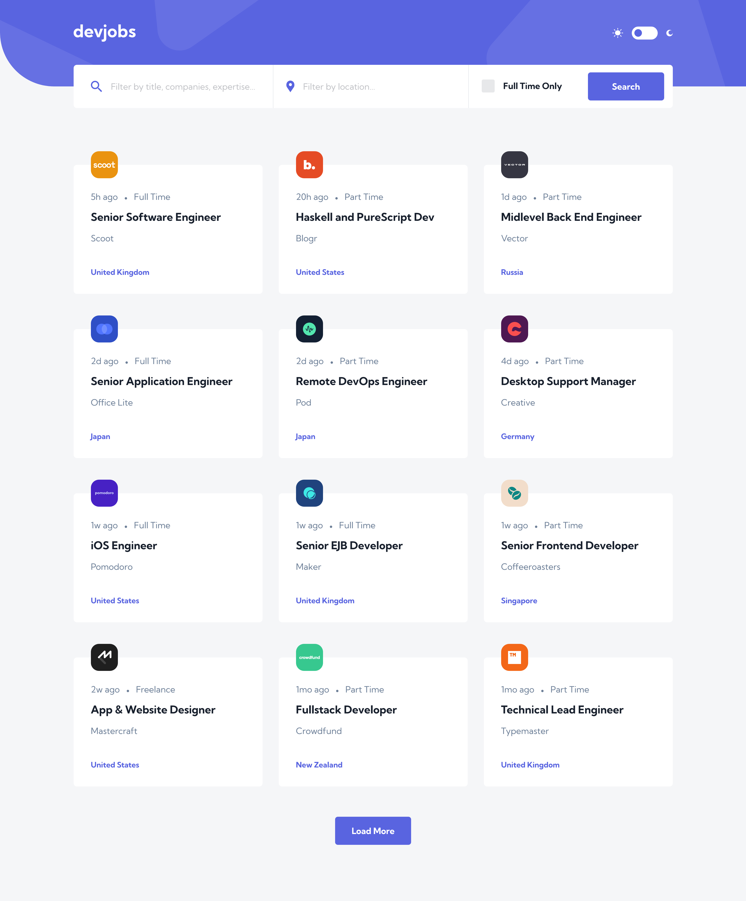
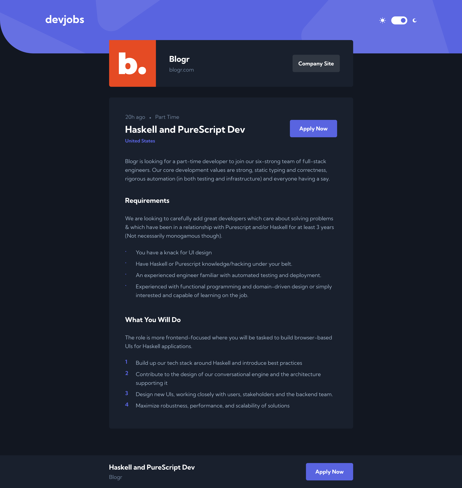

# Frontend Mentor - Devjobs web app solution

This is a solution to the [Devjobs web app challenge on Frontend Mentor](https://www.frontendmentor.io/challenges/devjobs-web-app-HuvC_LP4l).

## Overview

### The challenge

Users should be able to:

- View the optimal layout for each page depending on their device's screen size
- See hover states for all interactive elements throughout the site
- Be able to filter jobs on the index page by title, location, and whether a job is for a full-time position
- Be able to click a job from the index page so that they can read more information and apply for the job
- **Bonus**: Have the correct color scheme chosen for them based on their computer preferences. _Hint_: Research `prefers-color-scheme` in CSS.

### Screenshot

Home Page Light Theme            |  Details Page Dark Theme     
:-------------------------:|:-------------------------:
  |  

### Links

- Solution URL: [Github](https://github.com/yjcyun/frontend_mentor/tree/master/advanced/devjobs)
- Live Site URL: [Netlify](https://cyy-advanced-devjobs.netlify.app)

## My process

### Built with

- Vue3
- Vuex

### What I learned

- Learn Vue Composition API
- Get more familiar with Vuex
- Load more functionality with button click

## Author

- Website - [Christina Yun](https://christinayun.dev)
- Frontend Mentor - [@yjcyun](https://www.frontendmentor.io/profile/@yjcyun)

