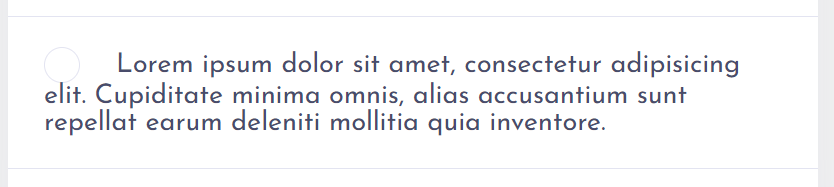
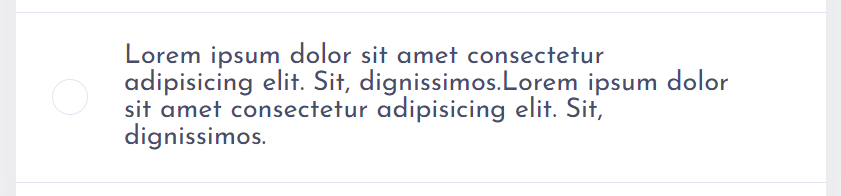

# Frontend Mentor - Todo app solution

This is a solution to the [Todo app challenge on Frontend Mentor](https://www.frontendmentor.io/challenges/todo-app-Su1_KokOW). Frontend Mentor challenges help you improve your coding skills by building realistic projects.

## Table of contents

- [Overview](#overview)
  - [The challenge](#the-challenge)
  - [Screenshot](#screenshot)
  - [Links](#links)
- [My process](#my-process)
  - [Built with](#built-with)
  - [What I learned](#what-i-learned)
- [How To Run](#how-to-run)
- [Author](#author)

## Overview

### The challenge

Users should be able to:

- View the optimal layout for the app depending on their device's screen size
- See hover states for all interactive elements on the page
- Add new todos to the list
- Mark todos as complete
- Delete todos from the list
- Filter by all/active/complete todos
- Clear all completed todos
- Toggle light and dark mode
- **Bonus**: Drag and drop to reorder items on the list

### Screenshot

### Links

- Solution URL: [Github](https://github.com/yjcyun/frontend_mentor/tree/master/intermediate/todo_app)
- Live Site URL: [Vercel](https://todo-app-gules-gamma.vercel.app/)

## My process

### Built with

- [React](https://reactjs.org/) - Create React App
- [Styled Components](https://styled-components.com/) - For styles
- [Typescript](https://create-react-app.dev/docs/adding-typescript/) - Props are typed
- [React Beautiful DND](https://github.com/atlassian/react-beautiful-dnd) - For Drag and Drop functionality

### What I learned

I would have to say the most challenging part of this project was the CSS.

1. **How to get gradient on border in CSS**? I ended up spending a lot of on this problem. Setting `border-image-slice: 1` and adding two linear gradients as a background property did the trick. [This YouTube tutorial](https://www.youtube.com/watch?v=RM3-IMRIEB4&ab_channel=CodyHouse) helped me understand the problem.
2. **Undesirable look when the content is overflown**. I had two choices: a) set a character limit to the input box; b) add flex to contain the text. I ended up setting the display flex to appropriate places to make this work.Here are before and after screenshots.

3. **React version compatibility problem with react-beautiful-dnd**. I wasn't able to install this npm package because this library was not upto date with the latest React version. I used `npm install --save react-beautiful-dnd --legacy-peer-deps` to install and I also had to remove `<React.StrictMode>` from `index.tsx`. Reference: [Link to Github Issue](https://github.com/atlassian/react-beautiful-dnd/issues/2408)

## How To Run

## Author

- Website - [Christina Yun](https://christinayun.dev)
- Frontend Mentor - [@yjcyun](https://www.frontendmentor.io/profile/yjcyun)
